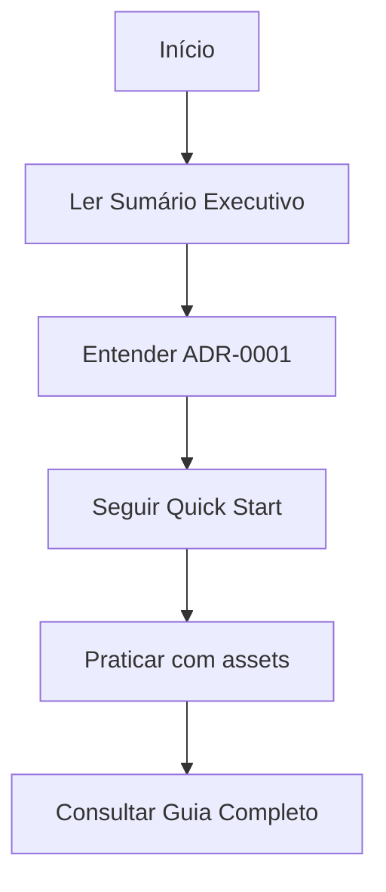
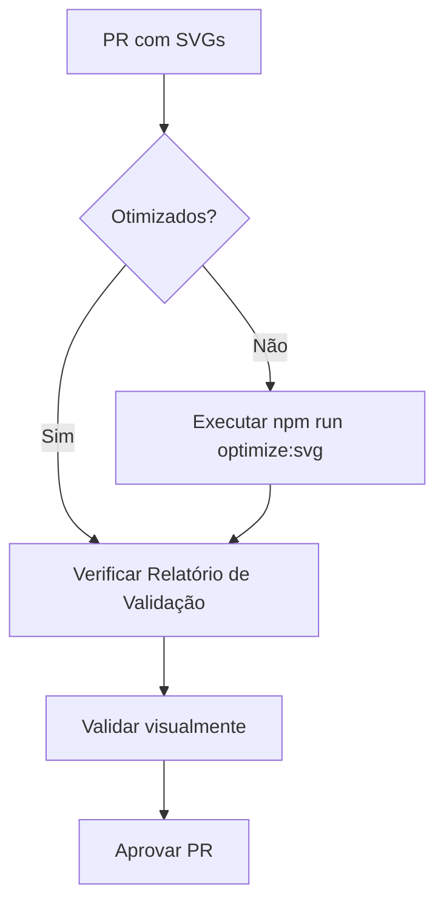

# 📚 Documentação do Projeto blip-tokens

Bem-vindo à documentação do projeto! Este diretório contém toda a documentação técnica, decisões arquiteturais e guias de uso.

## 📁 Estrutura de Documentação

```
docs/
├── ad/                     # Architecture Decisions
├── guides/                 # Guias de uso e implementação
└── reports/               # Relatórios técnicos e análises
```

---

## 🏛️ Architecture Decisions (AD)

Documentação de decisões arquiteturais importantes do projeto.

### ADs Disponíveis

- **[AD-001: Adotar SVGO para Otimização de SVG](./ad/001-adopt-svgo-for-svg-optimization.md)**
  - Status: 🔄 Em Revisão (19/11/2025)
  - Decisão de usar SVGO para otimizar 1,216 assets SVG
  - Resultados: 9.36% de redução, zero perda de qualidade

### O que é um AD?

Architecture Decisions documentam decisões importantes de arquitetura, incluindo:
- **Contexto**: Problema que precisa ser resolvido
- **Decisão**: Solução escolhida
- **Consequências**: Impactos positivos e negativos
- **Alternativas**: Opções consideradas e rejeitadas

---

## 📖 Guias

Documentação prática para desenvolvedores.

### Guias Disponíveis

#### [🚀 Quick Start - Otimização de SVG](./guides/svg-optimization-quickstart.md)
**Tempo de leitura: ~5 minutos**

Guia rápido para começar a otimizar SVGs:
- Instalação do SVGO
- Comandos básicos
- Scripts npm
- Troubleshooting comum

**Quando usar**: Primeira vez otimizando SVGs ou consulta rápida.

#### [📚 Guia Completo - Otimização de SVG](./guides/svg-optimization-comprehensive.md)
**Tempo de leitura: ~15 minutos**

Documentação abrangente incluindo:
- Análise detalhada do projeto
- Implementação passo a passo
- Integração com build tools
- Best practices
- Monitoramento e manutenção

**Quando usar**: Implementação completa ou entendimento profundo.

---

## 📊 Relatórios

Análises técnicas e resultados de implementação.

### Relatórios Disponíveis

#### [📈 Sumário Executivo](./reports/svg-optimization-summary.md)
**Tempo de leitura: ~2 minutos**

Visão geral de alto nível:
- Métricas principais
- ROI e benefícios
- Recomendações
- Comparações visuais

**Audiência**: Gestores, Product Owners, Stakeholders

#### [🔬 Relatório de Validação Técnica](./reports/svg-validation-report.md)
**Tempo de leitura: ~10 minutos**

Análise técnica detalhada:
- Validação de integridade
- Testes realizados
- Comparações matemáticas
- Garantias de qualidade
- Evidências técnicas

**Audiência**: Desenvolvedores, QA, Arquitetos

#### [📊 Análise Inicial de Assets](./reports/initial-analysis-report.md)
**Tempo de leitura: ~8 minutos**

Relatório de análise pré-otimização:
- Estatísticas completas (1,216 arquivos)
- Distribuição por categoria
- Top 10 maiores arquivos
- Oportunidades de otimização identificadas

**Audiência**: Desenvolvedores, Arquitetos

#### [🔮 Estimativas Pré-Otimização](./reports/pre-optimization-estimates.md)
**Tempo de leitura: ~5 minutos**

Previsões e metodologia de teste:
- Benchmarks da indústria
- Análise de amostras
- Projeções de redução
- Estimativas conservadoras (15-25%)

**Audiência**: Desenvolvedores, Tech Leads

#### [🖼️ Comparação Visual Interativa](./reports/test-visual-comparison.html)
**Tipo**: Ferramenta Web

Ferramenta HTML para validação visual:
- Comparação lado a lado (original vs otimizado)
- Análise de diferenças de tamanho
- Teste de integridade visual
- Interface interativa

**Audiência**: Designers, QA, Desenvolvedores

---

## 🎯 Navegação Rápida

### Por Função/Objetivo

| Se você quer... | Leia este documento |
|----------------|---------------------|
| Entender a decisão de otimizar SVGs | [AD-001](./ad/001-adopt-svgo-for-svg-optimization.md) |
| Começar a otimizar SVGs rapidamente | [Quick Start](./guides/svg-optimization-quickstart.md) |
| Implementar otimização completa | [Guia Completo](./guides/svg-optimization-comprehensive.md) |
| Ver métricas e ROI | [Sumário Executivo](./reports/svg-optimization-summary.md) |
| Validar qualidade técnica | [Relatório de Validação](./reports/svg-validation-report.md) |
| Ver análise pré-otimização | [Análise Inicial](./reports/initial-analysis-report.md) |
| Testar visualmente as alterações | [Comparação Visual](./reports/test-visual-comparison.html) |

### Por Persona

| Persona | Documentos Recomendados |
|---------|-------------------------|
| **Desenvolvedor Frontend** | Quick Start → Guia Completo |
| **DevOps/SRE** | AD-001 → Guia Completo |
| **QA/Tester** | Relatório de Validação |
| **Product Owner** | Sumário Executivo |
| **Arquiteto de Software** | AD-001 → Relatório de Validação |
| **Designer** | Sumário Executivo → Relatório de Validação |

---

## 📋 Fluxo de Trabalho Recomendado

### Para Novos Contribuidores



1. **Contexto Geral**: Ler [Sumário Executivo](./reports/svg-optimization-summary.md)
2. **Decisão Arquitetural**: Entender [AD-001](./ad/001-adopt-svgo-for-svg-optimization.md)
3. **Implementação**: Seguir [Quick Start](./guides/svg-optimization-quickstart.md)
4. **Aprofundamento**: Consultar [Guia Completo](./guides/svg-optimization-comprehensive.md) quando necessário

### Para Revisão de Código



1. Verificar se SVGs foram otimizados
2. Consultar [Relatório de Validação](./reports/svg-validation-report.md)
3. Executar `npm run optimize:svg:check`
4. Validar visualmente se necessário

---

## 🛠️ Scripts e Ferramentas

### Scripts NPM Disponíveis

```bash
# Otimizar todos os SVGs
npm run optimize:svg

# Verificar otimização (dry-run)
npm run optimize:svg:check

# Análise de tamanho e estrutura
npm run analyze:svg
```

### Arquivos de Configuração

- `svgo.config.js` - Configuração do SVGO
- `.nvmrc` - Versão do Node.js (18.20.8)
- `optimize-svgs.sh` - Script de otimização em lote
- `svg-analysis.sh` - Script de análise de assets

### Ferramentas de Teste

- `test-visual-comparison.html` - Comparação visual interativa
- `.backup-svgs-original/` - Backup dos assets originais

---

## 📚 Recursos Adicionais

### Documentação Externa

- [SVGO Documentation](https://github.com/svg/svgo)
- [SVG Specification](https://www.w3.org/TR/SVG2/)
- [Web Performance Best Practices](https://web.dev/optimize-images/)

### Artigos Relacionados

- [Why SVG Optimization Matters](https://css-tricks.com/understanding-and-manually-improving-svg-optimization/)
- [SVG vs PNG for Icons](https://www.sitepoint.com/svg-vs-png-for-icons/)

---

## 🔄 Processo de Atualização

### Adicionando Nova Documentação

1. **ADs**: Numerar sequencialmente (002, 003, etc.)
2. **Guias**: Adicionar em `guides/` com nome descritivo
3. **Relatórios**: Adicionar em `reports/` com data no nome
4. **Atualizar**: Este README.md com links

### Template AD

```markdown
# AD-XXX: Título da Decisão

## Status
[PROPOSTO | ACEITO | REJEITADO | DEPRECIADO | SUBSTITUÍDO]

## Contexto
[Descreva o problema e contexto]

## Decisão
[Descreva a decisão tomada]

## Consequências
[Descreva impactos positivos e negativos]

## Alternativas
[Descreva opções consideradas]
```

---

## 📞 Suporte

### Dúvidas Frequentes

**P: Onde encontro informações sobre otimização de SVG?**  
R: Comece pelo [Quick Start](./guides/svg-optimization-quickstart.md).

**P: Como validar se a otimização foi segura?**  
R: Consulte o [Relatório de Validação](./reports/svg-validation-report.md).

**P: Por que escolhemos SVGO?**  
R: Leia o [AD-001](./ad/001-adopt-svgo-for-svg-optimization.md).

### Contato

Para dúvidas ou sugestões sobre a documentação:
- Abra uma issue no repositório
- Entre em contato com a equipe de arquitetura

---

## 📊 Métricas de Documentação

| Métrica | Valor |
|---------|-------|
| ADs Ativos | 1 |
| Guias Disponíveis | 2 |
| Relatórios | 5 |
| Ferramentas Interativas | 1 |
| Última Atualização | 19/11/2025 |
| Cobertura | Otimização SVG ✅ |

---

## ✅ Checklist de Manutenção

- [ ] Revisar ADs a cada 6 meses
- [ ] Atualizar guias quando houver mudanças no SVGO
- [ ] Adicionar novos casos de uso conforme surgem
- [ ] Manter exemplos e screenshots atualizados
- [ ] Solicitar feedback de novos contribuidores

---

**Última Atualização**: 19 de Novembro de 2025  
**Mantido por**: Development Team  
**Versão**: 1.0
