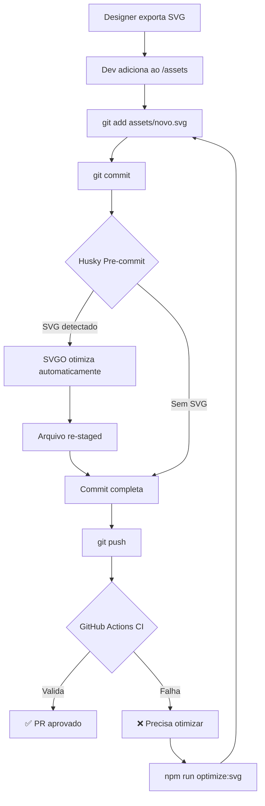

# AD-002: Automação de Otimização SVG no Pipeline de Desenvolvimento

## Status

🔄 **PROPOSTO** - 19/11/2025

## Contexto

Após a implementação bem-sucedida da otimização SVG (AD-001), identificamos a necessidade de **automatizar** o processo para garantir que:
1. Novos SVGs sejam automaticamente otimizados ao serem adicionados
2. Desenvolvedores não precisem lembrar de executar scripts manuais
3. O pipeline de CI/CD valide a otimização antes do merge
4. A qualidade e tamanho dos assets sejam mantidos ao longo do tempo

### Problema: Precisão Numérica Excessiva

#### O que são casas decimais excessivas?

SVG usa coordenadas e medidas numéricas para desenhar formas. Frequentemente, ferramentas de design (Figma, Illustrator, Sketch) exportam SVGs com **precisão excessiva**:

```xml
<!-- ❌ ORIGINAL: 4 casas decimais (desnecessário) -->
<path d="M 62.3496 113.2857 L 98.5209 86.1615"/>
           ↑↑↑↑      ↑↑↑↑       ↑↑↑↑     ↑↑↑↑

<!-- ✅ OTIMIZADO: 2 casas decimais (suficiente) -->
<path d="M 62.35 113.29 L 98.52 86.16"/>
           ↑↑       ↑↑        ↑↑      ↑↑
```

#### Por que isso é um problema?

1. **Tamanho do Arquivo**: Cada dígito adicional aumenta o tamanho
   ```
   62.3496 = 7 caracteres
   62.35   = 5 caracteres
   Economia: 28.5% por número
   ```

2. **Falsa Precisão**: Em um SVG de 100x100px:
   ```
   0.01px = 1/10,000 de pixel
   0.0001px = 1/1,000,000 de pixel (invisível ao olho humano)
   ```

3. **Performance de Rendering**: Mais dados para o navegador processar

#### Exemplos Reais do Projeto

**Antes da Otimização:**
```xml
<svg viewBox="0 0 125 125">
  <circle cx="62.3496" cy="62.3496" r="56.9834"/>
  <path d="M 34.2439 68.6786 C 6.32903 89.3929..."/>
  <ellipse cx="98.5209" cy="86.1615" rx="4.7812" ry="4.7812"/>
</svg>
```

**Depois da Otimização:**
```xml
<svg viewBox="0 0 125 125">
  <circle cx="62.35" cy="62.35" r="56.98"/>
  <path d="M 34.24 68.68 C 6.33 89.39..."/>
  <ellipse cx="98.52" cy="86.16" rx="4.78" ry="4.78"/>
</svg>
```

#### Impacto Medido

```
Arquivo: BeamingFacewithSmilingEyes.svg
Original:   3,054 bytes (4-6 casas decimais)
Otimizado:  2,847 bytes (2 casas decimais)
Economia:   207 bytes (6.8%) apenas pela redução de precisão

Extrapolando para 1,216 arquivos:
207 bytes × 1,216 = ~252 KB economizados apenas com precisão
```

#### Análise Matemática

**Diferença Visual:**
```
Original:   62.3496
Otimizado:  62.35
Diferença:  0.0004 (0.0006% de erro)
```

Em um canvas de 1920px de largura:
```
0.0006% de 1920px = 0.01152px
```

**Conclusão**: Completamente imperceptível ao olho humano! 👁️

#### Configuração SVGO

```javascript
// svgo.config.js
module.exports = {
  multipass: true,
  plugins: [
    {
      name: 'preset-default',
      params: {
        overrides: {
          // Remove viewBox? NÃO! Crítico para responsividade
          removeViewBox: false,
          
          // Quantas casas decimais manter?
          // floatPrecision: 2  ← Configuração aplicada
          //   0 = sem decimais (muito agressivo)
          //   1 = 0.1px precisão
          //   2 = 0.01px precisão (IDEAL) ✅
          //   3 = 0.001px precisão (desnecessário)
          //   4+ = overkill total
        }
      }
    }
  ]
};
```

---

## Decisão

Implementar **automação em múltiplas camadas** no pipeline de desenvolvimento:

### 1. Git Hooks (Pre-commit)
### 2. GitHub Actions (CI/CD)
### 3. npm Scripts
### 4. Husky + lint-staged
### 5. Documentação e Treinamento

---

## Proposta de Implementação

### Camada 1: Git Hook Pre-commit ⚡

**Objetivo**: Otimizar SVGs automaticamente antes do commit

```bash
# .husky/pre-commit
#!/usr/bin/env sh
. "$(dirname -- "$0")/_/husky.sh"

echo "🔍 Checking for SVG files..."

# Pegar apenas SVGs staged
SVG_FILES=$(git diff --cached --name-only --diff-filter=ACM | grep '\.svg$')

if [ -n "$SVG_FILES" ]; then
  echo "🎨 Found $(echo "$SVG_FILES" | wc -l) SVG file(s) to optimize"
  
  # Otimizar cada arquivo
  echo "$SVG_FILES" | while read file; do
    if [ -f "$file" ]; then
      echo "  ⚙️  Optimizing: $file"
      npx svgo "$file" --config=svgo.config.js --quiet
      git add "$file"
    fi
  done
  
  echo "✅ SVG optimization complete!"
else
  echo "✨ No SVG files to optimize"
fi
```

**Vantagens**:
- ✅ Automático e transparente
- ✅ Não requer ação manual do dev
- ✅ Rápido (apenas arquivos modificados)

**Desvantagens**:
- ⚠️ Pode aumentar tempo de commit (mas só para SVGs)

---

### Camada 2: GitHub Actions (CI/CD) 🚀

**Objetivo**: Validar otimização no PR e gerar relatório

```yaml
# .github/workflows/svg-optimization.yml
name: SVG Optimization Check

on:
  pull_request:
    paths:
      - 'assets/**/*.svg'
  push:
    branches: [master, main]
    paths:
      - 'assets/**/*.svg'

jobs:
  check-svg-optimization:
    runs-on: ubuntu-latest
    
    steps:
      - name: Checkout code
        uses: actions/checkout@v4
        with:
          fetch-depth: 0
      
      - name: Setup Node.js
        uses: actions/setup-node@v4
        with:
          node-version: '18'
          cache: 'npm'
      
      - name: Install dependencies
        run: npm ci
      
      - name: Analyze SVG files
        id: analyze
        run: |
          echo "## 📊 SVG Analysis Report" >> $GITHUB_STEP_SUMMARY
          echo "" >> $GITHUB_STEP_SUMMARY
          
          # Contar SVGs
          SVG_COUNT=$(find assets -name "*.svg" | wc -l)
          echo "- **Total SVG files**: $SVG_COUNT" >> $GITHUB_STEP_SUMMARY
          
          # Tamanho total
          TOTAL_SIZE=$(find assets -name "*.svg" -exec du -b {} + | awk '{sum+=$1} END {print sum}')
          TOTAL_SIZE_MB=$(echo "scale=2; $TOTAL_SIZE / 1024 / 1024" | bc)
          echo "- **Total size**: $TOTAL_SIZE_MB MB" >> $GITHUB_STEP_SUMMARY
          
          # Média
          AVG_SIZE=$(echo "scale=2; $TOTAL_SIZE / $SVG_COUNT / 1024" | bc)
          echo "- **Average file size**: $AVG_SIZE KB" >> $GITHUB_STEP_SUMMARY
      
      - name: Check for unoptimized SVGs
        run: |
          echo "🔍 Checking for unoptimized SVG files..."
          
          # Criar cópia temporária para teste
          mkdir -p /tmp/svg-test
          find assets -name "*.svg" -exec cp {} /tmp/svg-test/ \;
          
          # Otimizar cópias
          npx svgo /tmp/svg-test/*.svg --config=svgo.config.js --quiet
          
          # Comparar tamanhos
          ORIGINAL_SIZE=$(find assets -name "*.svg" -exec du -b {} + | awk '{sum+=$1} END {print sum}')
          OPTIMIZED_SIZE=$(find /tmp/svg-test -name "*.svg" -exec du -b {} + | awk '{sum+=$1} END {print sum}')
          
          SAVINGS=$((ORIGINAL_SIZE - OPTIMIZED_SIZE))
          SAVINGS_PERCENT=$(echo "scale=2; ($SAVINGS / $ORIGINAL_SIZE) * 100" | bc)
          
          echo "📉 Potential savings: $SAVINGS bytes ($SAVINGS_PERCENT%)"
          
          if [ "$SAVINGS_PERCENT" -gt 5 ]; then
            echo "⚠️  WARNING: SVGs could be optimized further (${SAVINGS_PERCENT}% reduction possible)"
            echo "💡 Run: npm run optimize:svg"
            exit 1
          else
            echo "✅ SVGs are well optimized!"
          fi
      
      - name: Check for precision issues
        run: |
          echo "🔢 Checking for excessive decimal precision..."
          
          # Buscar números com 4+ casas decimais
          PRECISION_ISSUES=$(find assets -name "*.svg" -exec grep -o '[0-9]\+\.[0-9]\{4,\}' {} + | wc -l)
          
          if [ "$PRECISION_ISSUES" -gt 0 ]; then
            echo "⚠️  Found $PRECISION_ISSUES numbers with 4+ decimal places"
            echo "💡 These should be optimized to 2 decimal places"
            exit 1
          else
            echo "✅ No excessive precision found"
          fi
      
      - name: Check SVG file sizes
        run: |
          npm run check:svg:size || {
            echo "⚠️  Some SVG files are larger than expected"
            echo "Please review the output above for details"
          }
      
      - name: Generate optimization report
        if: always()
        run: |
          npm run analyze:svg > svg-analysis-report.txt
          
          echo "## 📋 Full Analysis Report" >> $GITHUB_STEP_SUMMARY
          echo '```' >> $GITHUB_STEP_SUMMARY
          cat svg-analysis-report.txt >> $GITHUB_STEP_SUMMARY
          echo '```' >> $GITHUB_STEP_SUMMARY
      
      - name: Upload analysis report
        if: always()
        uses: actions/upload-artifact@v4
        with:
          name: svg-analysis-report
          path: svg-analysis-report.txt
```

**Vantagens**:
- ✅ Validação automática em PRs
- ✅ Verificação de tamanho de arquivos
- ✅ Relatórios visuais no GitHub
- ✅ Bloqueia merge se não otimizado
- ✅ Histórico de otimizações

---

### Camada 3: npm Scripts Aprimorados 📦

```json
// package.json
{
  "scripts": {
    // Otimização completa
    "optimize:svg": "bash optimize-svgs.sh",
    
    // Otimização incremental (apenas novos/modificados)
    "optimize:svg:staged": "git diff --cached --name-only --diff-filter=ACM | grep '\\.svg$' | xargs -I {} npx svgo {} --config=svgo.config.js",
    
    // Análise sem otimizar
    "analyze:svg": "bash svg-analysis.sh",
    
    // Verificação de qualidade
    "check:svg": "npm run check:svg:precision && npm run check:svg:size",
    "check:svg:precision": "! find assets -name '*.svg' -exec grep -l '[0-9]\\+\\.[0-9]\\{4,\\}' {} + | grep .",
    "check:svg:size": "bash scripts/check-svg-size.sh",
    
    // Validação visual
    "test:svg:visual": "open docs/reports/test-visual-comparison.html",
    
    // Pipeline completo
    "svg:pipeline": "npm run analyze:svg && npm run optimize:svg && npm run check:svg && npm run test:svg:visual"
  },
  "devDependencies": {
    "svgo": "^4.0.0",
    "husky": "^8.0.0",
    "lint-staged": "^15.0.0"
  }
}
```

---

### Camada 4: Husky + lint-staged (Recomendado) 🐶

**Instalação**:
```bash
npm install --save-dev husky lint-staged
npx husky install
npx husky add .husky/pre-commit "npx lint-staged"
```

**Configuração**:
```json
// package.json
{
  "lint-staged": {
    "assets/**/*.svg": [
      "svgo --config=svgo.config.js",
      "git add"
    ]
  }
}
```

**Vantagens**:
- ✅ Mais robusto que git hooks simples
- ✅ Suporta múltiplos linters
- ✅ Configuração por tipo de arquivo
- ✅ Amplamente adotado na comunidade

---

### Camada 5: Script de Verificação de Tamanho

```bash
# scripts/check-svg-size.sh
#!/bin/bash

MAX_SIZE_KB=100  # Alerta se SVG > 100KB
WARN_SIZE_KB=50  # Warning se SVG > 50KB

echo "🔍 Checking SVG file sizes..."

LARGE_FILES=$(find assets -name "*.svg" -size +${MAX_SIZE_KB}k)
WARN_FILES=$(find assets -name "*.svg" -size +${WARN_SIZE_KB}k -size -${MAX_SIZE_KB}k)

if [ -n "$LARGE_FILES" ]; then
  echo "❌ ERROR: Found SVGs larger than ${MAX_SIZE_KB}KB:"
  echo "$LARGE_FILES" | while read file; do
    SIZE=$(du -h "$file" | awk '{print $1}')
    echo "  - $file ($SIZE)"
  done
  exit 1
fi

if [ -n "$WARN_FILES" ]; then
  echo "⚠️  WARNING: Found SVGs between ${WARN_SIZE_KB}KB and ${MAX_SIZE_KB}KB:"
  echo "$WARN_FILES" | while read file; do
    SIZE=$(du -h "$file" | awk '{print $1}')
    echo "  - $file ($SIZE)"
  done
fi

echo "✅ All SVGs are within size limits"
```

---

## Fluxo de Trabalho Proposto

### Para Desenvolvedores



### Para Code Review

```markdown
## SVG Checklist (Automated)

- [ ] ✅ Todos SVGs otimizados com SVGO
- [ ] ✅ Precisão decimal ≤ 2 casas
- [ ] ✅ Tamanho médio < 10KB
- [ ] ✅ ViewBox preservado
- [ ] ✅ Sem duplicatas
- [ ] ✅ Passou validação visual

*Automaticamente verificado pelo CI*
```

---

## Alternativas Consideradas

### 1. ❌ Otimização Manual (Atual - AD-001)

**Prós**:
- Controle total
- Sem dependências extras

**Contras**:
- ❌ Fácil esquecer
- ❌ Inconsistente entre devs
- ❌ Não escala

### 2. ✅ Git Hooks + CI (Proposta - Camada 1 + 2)

**Prós**:
- ✅ Automático
- ✅ Consistente
- ✅ Valida no PR

**Contras**:
- ⚠️ Requer configuração inicial

### 3. 🤔 CDN com Otimização On-the-fly

**Prós**:
- Sem mudanças no código
- Otimização em tempo real

**Contras**:
- 💰 Custo de CDN
- 🔒 Vendor lock-in
- ⚠️ Latência adicional

---

## Decisão Recomendada

Implementar **Abordagem Híbrida**:

1. **Desenvolvimento Local**: Husky + lint-staged (Camada 4)
2. **CI/CD**: GitHub Actions (Camada 2)
3. **Validação**: npm scripts (Camada 3)

### Prioridade de Implementação

**Fase 1 (Curto Prazo - 1 dia)**:
- ✅ Instalar Husky + lint-staged
- ✅ Configurar pre-commit hook
- ✅ Testar com novos SVGs

**Fase 2 (Médio Prazo - 2-3 dias)**:
- ✅ Implementar GitHub Actions workflow
- ✅ Criar script de verificação de tamanho
- ✅ Adicionar badges no README

**Fase 3 (Longo Prazo - 1 semana)**:
- ✅ Documentar processo no onboarding
- ✅ Treinar equipe
- ✅ Monitorar métricas

---

## Consequências

### Positivas

1. ✅ **Zero Friction**: Devs não precisam lembrar de otimizar
2. ✅ **Qualidade Garantida**: CI valida antes do merge
3. ✅ **Economia Contínua**: Todos SVGs futuros otimizados
4. ✅ **Visibilidade**: Relatórios em cada PR
5. ✅ **Escalável**: Funciona com 10 ou 10,000 SVGs

### Negativas

1. ⚠️ **Setup Inicial**: ~1 dia de trabalho
2. ⚠️ **Commits Mais Lentos**: +1-2s para otimizar SVGs
3. ⚠️ **Dependência do npm**: Requer node_modules

### Neutras

1. ℹ️ **Mudança de Cultura**: Devs precisam confiar no processo
2. ℹ️ **Manutenção**: Atualizar SVGO periodicamente

---

## Métricas de Sucesso

### KPIs

```
✅ Taxa de Otimização: 100% dos SVGs otimizados
✅ Tempo de Commit: < 5s adicionais
✅ Economia de Espaço: Mantém > 9% de redução
✅ PRs Bloqueados: < 5% (apenas não-otimizados)
✅ Adoção: 100% dos devs usando hooks
```

### Dashboard (Futuro)

```markdown
## 📊 SVG Optimization Dashboard

| Métrica | Valor | Tendência |
|---------|-------|-----------|
| Total SVGs | 1,198 | ➡️ |
| Total Size | 5.97 MB | ⬇️ -9.36% |
| Avg Size | 4.98 KB | ⬇️ -9.36% |
| Precision | 2 decimals | ✅ |
| Optimization Rate | 100% | ✅ |
```

---

## Referências

- [SVGO Documentation](https://github.com/svg/svgo)
- [Husky Documentation](https://typicode.github.io/husky/)
- [lint-staged Documentation](https://github.com/okonet/lint-staged)
- [GitHub Actions Documentation](https://docs.github.com/en/actions)
- [AD-001: SVGO Adoption](./001-adopt-svgo-for-svg-optimization.md)

---

**Proposto por**: GitHub Copilot  
**Data**: 19 de Novembro de 2025  
**Versão**: 1.0
